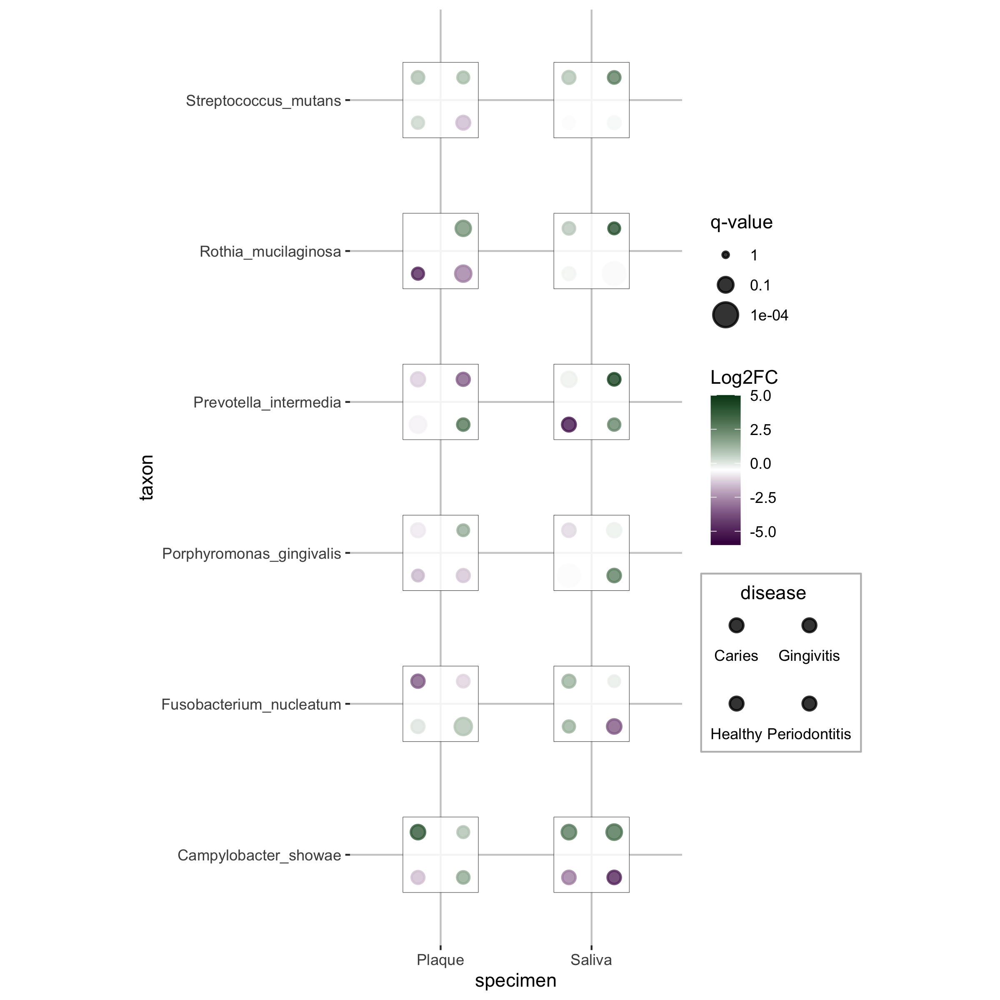
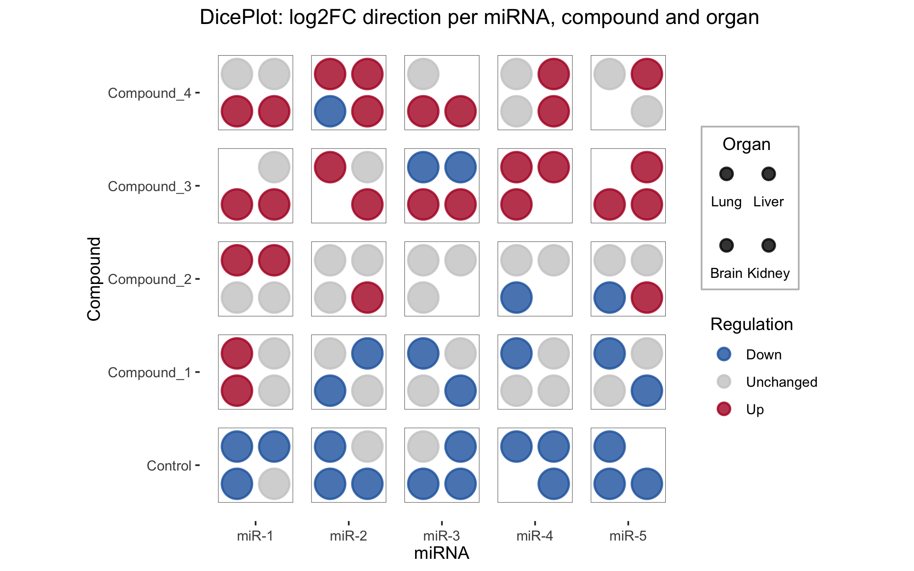
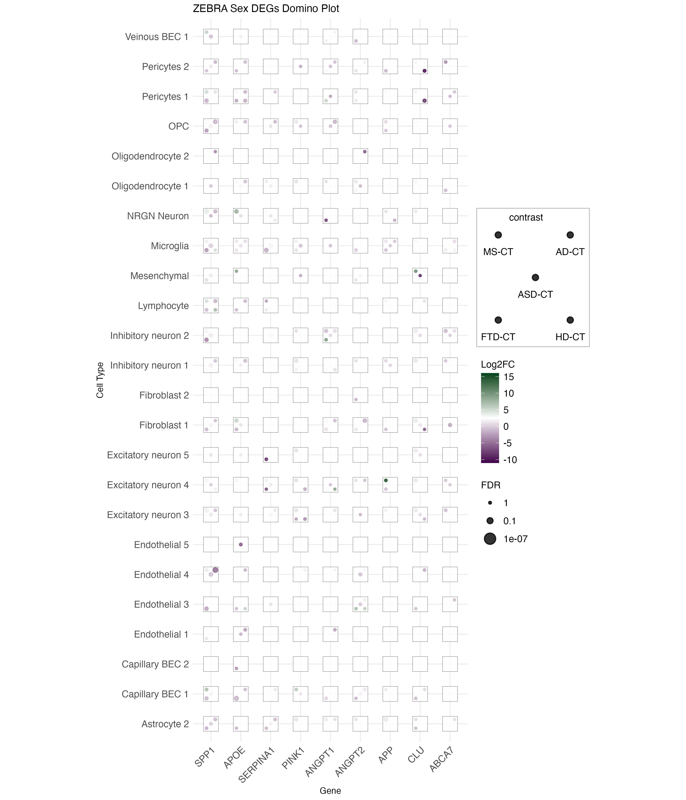

[](https://CRAN.R-project.org/package=ggdiceplot)
[](https://CRAN.R-project.org/package=ggdiceplot)


# ggdiceplot

> [!Note]
> This repository is in active development
> Please report errors or other issues to help improve the package!

A ggplot2 extension for creating dice plot visualizations, where each dice represents multiple categorical variables using the traditional dice dot patterns.

## Installation

```r
# Install from local directory
devtools::install_local("path/to/ggdiceplot")
```

```r
install.packages(c("ggdiceplot"))
```

## Example: Taxonomy

```r
library(ggplot2)
library(ggdiceplot)

data("sample_dice_data1", package = "ggdiceplot")
toy_data <- sample_dice_data1

lo      <- floor(min(toy_data$lfc, na.rm = TRUE))
up      <- ceiling(max(toy_data$lfc, na.rm = TRUE))
mid     <- (lo + up) / 2
minsize <- floor(min(-log10(toy_data$q), na.rm = TRUE))
maxsize <- ceiling(max(-log10(toy_data$q), na.rm = TRUE))
midsize <- ceiling(quantile(-log10(toy_data$q), 0.5, na.rm = TRUE))

ggplot(toy_data, aes(x = specimen, y = taxon)) +
  geom_dice(
    aes(dots = disease, fill = lfc, size = -log10(q), width = 0.5, height = 0.5),
    na.rm       = TRUE,
    show.legend = TRUE,
    ndots       = length(unique(toy_data$disease)),
    x_length    = length(unique(toy_data$specimen)),
    y_length    = length(unique(toy_data$taxon))
  ) +
  scale_fill_continuous(name = "lfc") +
  scale_fill_gradient2(
    low = "#40004B", high = "#00441B", mid = "white",
    na.value = "white", limit = c(lo, up), midpoint = mid,
    name = "Log2FC"
  ) +
  scale_size_continuous(
    range  = c(2, 8),
    limits = c(minsize, maxsize),
    breaks = c(minsize, midsize, maxsize),
    labels = c(10^minsize, 10^-midsize, 10^-maxsize),
    name   = "q-value"
  )
```



## Example: miRNA dysregulation

```r
library(ggplot2)
library(ggdiceplot)

data("sample_dice_miRNA", package = "ggdiceplot")
df_dice <- sample_dice_miRNA

direction_colors <- c(Down = "#2166ac", Unchanged = "grey80", Up = "#b2182b")

ggplot(df_dice, aes(x = miRNA, y = Compound)) +
  geom_dice(
    aes(dots = Organ, fill = direction, width = 0.8, height = 0.8),
    show.legend = TRUE,
    pip_fill    = 1.0,
    ndots       = length(levels(df_dice$Organ)),
    x_length    = length(levels(df_dice$miRNA)),
    y_length    = length(levels(df_dice$Compound))
  ) +
  scale_fill_manual(values = direction_colors, name = "Regulation") +
  theme_dice() +
  theme(
    axis.text.x = element_text(angle = 0, hjust = 0.5, vjust = 0.5),
    axis.text.y = element_text(hjust = 1),
    panel.grid  = element_blank()
  ) +
  labs(
    title = "DicePlot: log2FC direction per miRNA, compound and organ",
    x = "miRNA",
    y = "Compound"
  )
```



## Example: ZEBRA Domino Plot

This example demonstrates using `geom_dice()` to create a domino plot for gene expression analysis across multiple diseases and cell types.

```r
library(ggplot2)
library(ggdiceplot)
library(dplyr)
library(tidyr)

zebra.df <- read.csv("legacy examples/data/ZEBRA_sex_degs_set.csv")
genes <- c("SPP1", "APOE", "SERPINA1", "PINK1", "ANGPT1", "ANGPT2", "APP", "CLU", "ABCA7")

zebra.df <- zebra.df %>%
  filter(gene %in% genes) %>%
  filter(contrast %in% c("MS-CT", "AD-CT", "ASD-CT", "FTD-CT", "HD-CT")) %>%
  mutate(
    cell_type = factor(cell_type, levels = sort(unique(cell_type))),
    contrast  = factor(contrast, levels = c("MS-CT", "AD-CT", "ASD-CT", "FTD-CT", "HD-CT")),
    gene      = factor(gene, levels = genes)
  ) %>%
  filter(PValue < 0.05) %>%
  group_by(gene, cell_type, contrast) %>%
  summarise(logFC = mean(logFC, na.rm = TRUE), FDR = min(FDR, na.rm = TRUE), .groups = "drop") %>%
  complete(gene, cell_type, contrast, fill = list(logFC = NA_real_, FDR = NA_real_))

lo      <- floor(min(zebra.df$logFC, na.rm = TRUE))
up      <- ceiling(max(zebra.df$logFC, na.rm = TRUE))
mid     <- (lo + up) / 2
minsize <- floor(min(-log10(zebra.df$FDR), na.rm = TRUE))
maxsize <- ceiling(max(-log10(zebra.df$FDR), na.rm = TRUE))
midsize <- ceiling(quantile(-log10(zebra.df$FDR), 0.5, na.rm = TRUE))

ggplot(zebra.df, aes(x = gene, y = cell_type)) +
  geom_dice(
    aes(dots = contrast, fill = logFC, size = -log10(FDR)),
    na.rm       = TRUE,
    show.legend = TRUE,
    ndots       = 5,
    x_length    = length(genes),
    y_length    = length(unique(zebra.df$cell_type))
  ) +
  scale_fill_gradient2(
    low = "#40004B", high = "#00441B", mid = "white",
    na.value = "white", limit = c(lo, up), midpoint = mid,
    name = "Log2FC"
  ) +
  scale_size_continuous(
    limits = c(minsize, maxsize),
    breaks = c(minsize, midsize, maxsize),
    labels = c(10^minsize, 10^-midsize, 10^-maxsize),
    name   = "FDR"
  ) +
  theme_minimal() +
  theme(
    axis.text.x     = element_text(angle = 45, hjust = 1, size = 12),
    axis.text.y     = element_text(size = 12),
    legend.text     = element_text(size = 12),
    legend.title    = element_text(size = 12),
    legend.key      = element_blank(),
    legend.key.size = unit(0.8, "cm")
  ) +
  labs(x = "Gene", y = "Cell Type", title = "ZEBRA Sex DEGs Domino Plot")

ggsave("ZEBRA_domino_example.png", width = 12, height = 14, dpi = 300)
```



## Features

- **1:1 Aspect Ratio**: Dice automatically appear as perfect squares using `coord_fixed(ratio = 1)`
- **Automatic Pip Scaling**: `pip_fill` (0–1) controls pip diameter as a fraction of the maximum available space. `pip_fill = 1.0` fills the die face fully; set to `NULL` to use a fixed size
- **Boundary Safety**: Pips never exceed tile borders; positions shift inward as density increases
- **Flexible Mapping**: Map any categories to dice positions 1–6
- **Multiple Applications**: Gene expression, survey data, clinical trials, market research
- **Customizable**: Control dice size, colors, pip density, and positioning

## Key Parameters

| Parameter | Description |
|-----------|-------------|
| `dots` | Aesthetic mapping — which category occupies which pip position |
| `pip_fill` | Pip diameter as fraction of max space (default `0.75`; `1.0` = tight fill; `NULL` = fixed size) |
| `ndots` | Number of pip positions on each die face (1–6) |
| `x_length`, `y_length` | Grid dimensions (used for aspect ratio) |
| `na.rm` | Drop observations with missing size/fill values |

## Key Functions

- `geom_dice()`: Main geom for creating dice plots with automatic 1:1 aspect ratio
- `theme_dice()`: Minimal theme optimized for dice plots
- `create_dice_positions()`: Generate standard dice dot position layouts
- `make_offsets()`: Calculate pip positions for rendering

## Running the Examples

```bash
# From the project root
Rscript demo_output/create_demo_plots.R
Rscript test_simple_dice.R
```

## Package Structure

- `R/`: Core package functions
- `data/`: Sample datasets
- `demo_output/`: Example plots and output images
- `examples/`: Real-world usage examples
- `legacy examples/`: Legacy examples and data files
- `man/`: Documentation files

## Citation

If you use this code or the R and Python packages for your own work, please cite diceplot as:

> M. Flotho, P. Flotho, A. Keller, "DicePlot: a package for high-dimensional categorical data visualization," *Bioinformatics*, vol. 42, no. 2, btaf337, 2026.

BibTeX entry:
```bibtex
@article{flotho2026diceplot,
    title     = {DicePlot: a package for high-dimensional categorical data visualization},
    author    = {Flotho, Matthias and Flotho, Philipp and Keller, Andreas},
    journal   = {Bioinformatics},
    volume    = {42},
    number    = {2},
    pages     = {btaf337},
    year      = {2026},
    publisher = {Oxford University Press}
}
```

## License

This package is licensed under [LICENSE](LICENSE).
