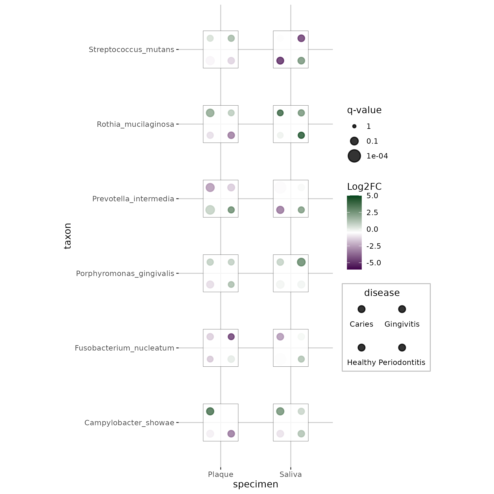
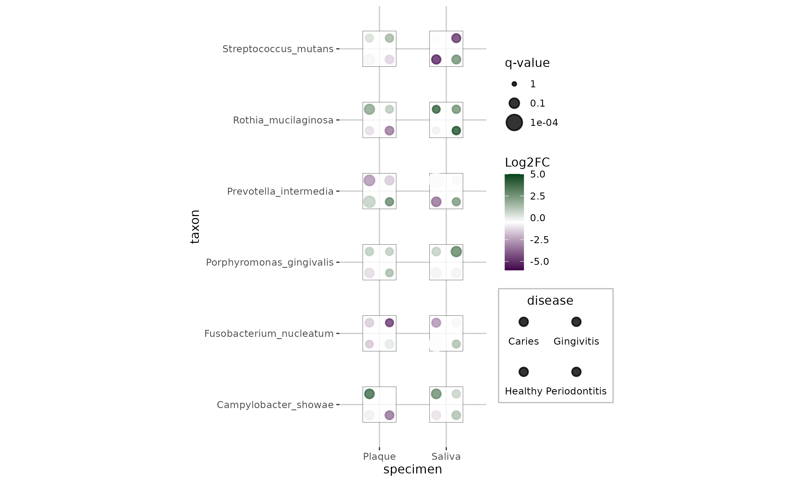
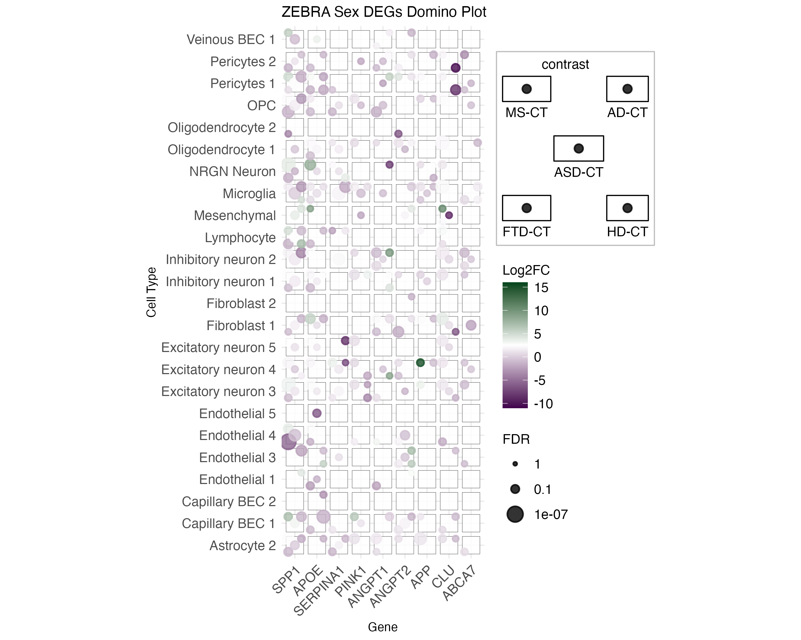
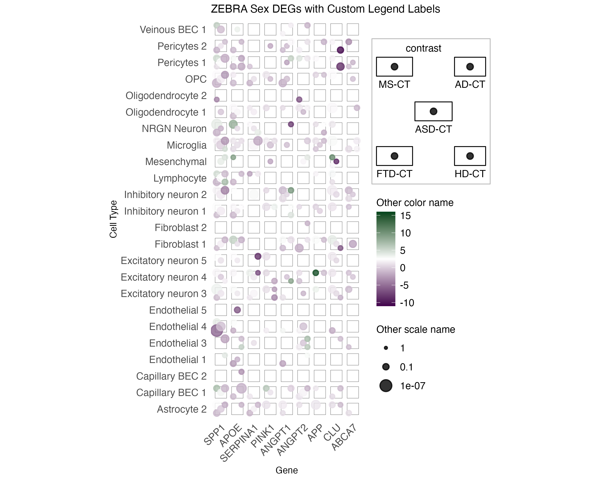

[](https://CRAN.R-project.org/package=ggdiceplot)
[](https://CRAN.R-project.org/package=ggdiceplot)


# ggdiceplot

> [!Note]
> This repository is in active development
> Please report errors or other issues to help improve the package!

A ggplot2 extension for creating dice plot visualizations, where each dice represents multiple categorical variables using the traditional dice dot patterns.

## Installation

```r
# Install from local directory
devtools::install_local("path/to/ggdiceplot")

# Or install dependencies manually
install.packages(c("ggplot2", "tibble"))
```

```r
install.packages(c("ggdiceplot"))
```

## Example 1

```r
library(ggplot2)
library(ggdiceplot)

# Create sample data
toy_data1 <- data(sample_dice_data1)

# Effect size
lo = floor(min(toy_data$lfc, na.rm = TRUE))
up = ceiling(max(toy_data$lfc, na.rm=TRUE))
mid = (lo + up)/2

minsize = floor(min(-log10(toy_data$q), na.rm=TRUE))
maxsize = ceiling(max(-log10(toy_data$q), na.rm=TRUE))
midsize = ceiling(quantile(-log10(toy_data$q), c(0.5), na.rm=TRUE))

#
## PLOT
#

ggplot(toy_data1, aes(x=specimen, y=taxon)) +
  geom_dice(aes(dots=disease, fill=lfc, size=-log10(q), 
                # Square dims
                width = 0.5, height = 0.5),
            # For legend display
            show.legend=TRUE, 
            # For legend position calculation
            ndots=length(unique(toy_data$disease)),
            # For aspect.ratio: ensure squares (now automatic with coord_fixed)
            x_length = length(unique(toy_data$specimen)), 
            y_length = length(unique(toy_data$taxon)), 
            )+
  scale_fill_continuous(name="lfc") +
  scale_fill_gradient2(low = "#40004B", high = "#00441B", mid = "white",
                        na.value = "white", 
                       limit = c(lo, up),
                       midpoint = mid, 
                        name = "Log2FC") +
  scale_size_continuous(limits = c(minsize, maxsize),
                        breaks = c(minsize, midsize, maxsize),
                        labels = c(10^minsize, 10^-midsize, 10^-maxsize),
                        name = "q-value")
```



## Example 2

```r
library(ggplot2)
library(ggdiceplot)

toy_data <- data(sample_dice_data2)

#
## PARAMS
#

# Effect size
lo = floor(min(toy_data$lfc, na.rm = TRUE))
up = ceiling(max(toy_data$lfc, na.rm=TRUE))
mid = (lo + up)/2

minsize = floor(min(-log10(toy_data$q), na.rm=TRUE))
maxsize = ceiling(max(-log10(toy_data$q), na.rm=TRUE))
midsize = ceiling(quantile(-log10(toy_data$q), c(0.5), na.rm=TRUE))

#
## PLOT
#

ggplot(toy_data, aes(x=specimen, y=taxon)) +
  geom_dice(aes(dots=disease, fill=lfc, size=-log10(q), 
                # Square dims
                width = 0.5, height = 0.5),
            # For missing info
            na.rm = TRUE,
            # For legend display
            show.legend=TRUE, 
            # For legend position calculation
            ndots=length(unique(toy_data$disease)),
            # For aspect.ratio: ensure squares (now automatic with coord_fixed)
            x_length = length(unique(toy_data$specimen)), 
            y_length = length(unique(toy_data$taxon)), 
  )+
  scale_fill_continuous(name="lfc") +
  scale_fill_gradient2(low = "#40004B", high = "#00441B", mid = "white",
                       na.value = "white", 
                       limit = c(lo, up),
                       midpoint = mid, 
                       name = "Log2FC") +
  scale_size_continuous(limits = c(minsize, maxsize),
                        breaks = c(minsize, midsize, maxsize),
                        labels = c(10^minsize, 10^-midsize, 10^-maxsize),
                        name = "q-value")
```


## Example 3: ZEBRA Domino Plot

This example demonstrates using `geom_dice()` to create a domino plot for gene expression analysis across multiple diseases and cell types.

```r
library(ggplot2)
library(ggdiceplot)
library(dplyr)
library(tidyr)

# Load ZEBRA dataset
zebra.df <- read.csv("legacy examples/data/ZEBRA_sex_degs_set.csv")

# Select genes of interest
genes <- c("SPP1", "APOE", "SERPINA1", "PINK1", "ANGPT1", "ANGPT2", "APP", "CLU", "ABCA7")

# Filter and prepare data
zebra.df <- zebra.df %>% 
  filter(gene %in% genes) %>%
  filter(contrast %in% c("MS-CT", "AD-CT", "ASD-CT", "FTD-CT", "HD-CT")) %>%
  mutate(
    cell_type = factor(cell_type, levels = sort(unique(cell_type))),
    contrast = factor(contrast, levels = c("MS-CT", "AD-CT", "ASD-CT", "FTD-CT", "HD-CT")),
    gene = factor(gene, levels = genes)
  ) %>%
  filter(PValue < 0.05) %>%
  group_by(gene, cell_type, contrast) %>%
  summarise(
    logFC = mean(logFC, na.rm = TRUE),
    FDR = min(FDR, na.rm = TRUE),
    .groups = "drop"
  ) %>%
  complete(gene, cell_type, contrast, fill = list(logFC = NA, FDR = NA))

# Calculate scale limits
lo <- floor(min(zebra.df$logFC, na.rm = TRUE))
up <- ceiling(max(zebra.df$logFC, na.rm = TRUE))
mid <- (lo + up) / 2

minsize <- floor(min(-log10(zebra.df$FDR), na.rm = TRUE))
maxsize <- ceiling(max(-log10(zebra.df$FDR), na.rm = TRUE))
midsize <- ceiling(quantile(-log10(zebra.df$FDR), c(0.5), na.rm = TRUE))

# Create domino plot
ggplot(zebra.df, aes(x = gene, y = cell_type)) +
  geom_dice(
    aes(
      dots = contrast,
      fill = logFC,
      size = -log10(FDR),
      width = 0.8,
      height = 0.8
    ),
    na.rm = TRUE,
    show.legend = TRUE,
    ndots = 5,  # We have 5 contrasts
    x_length = length(genes),
    y_length = length(unique(zebra.df$cell_type))
  ) +
  scale_fill_gradient2(
    low = "#40004B",
    high = "#00441B",
    mid = "white",
    na.value = "white",
    limit = c(lo, up),
    midpoint = mid,
    name = "Log2FC"
  ) +
  scale_size_continuous(
    limits = c(minsize, maxsize),
    breaks = c(minsize, midsize, maxsize),
    labels = c(10^minsize, 10^-midsize, 10^-maxsize),
    name = "FDR"
  ) +
  theme_minimal() +
  theme(
    axis.text.x = element_text(angle = 45, hjust = 1, size = 12),
    axis.text.y = element_text(size = 12),
    legend.text = element_text(size = 12),
    legend.title = element_text(size = 12),
    legend.key = element_blank(),
    legend.key.size = unit(0.8, "cm")
  ) +
  labs(
    x = "Gene",
    y = "Cell Type",
    title = "ZEBRA Sex DEGs Domino Plot"
  )
```



**Alternative with custom legend labels:**



## Features

- **1:1 Aspect Ratio**: Dice automatically appear as perfect squares using `coord_fixed(ratio = 1)`
- **Automatic Sizing**: Dice automatically scale based on grid density
- **Boundary Safety**: Dice stay within plot boundaries
- **Flexible Mapping**: Map any categories to dice positions 1-6
- **Multiple Applications**: Gene expression, survey data, clinical trials, market research
- **Customizable**: Control dice size, colors, and positioning

## Important Update

**Automatic Aspect Ratio Control**: As of the latest version, `geom_dice()` automatically applies `coord_fixed(ratio = 1)` to ensure dice appear as perfect squares. The `x_length` and `y_length` parameters are maintained for compatibility but no longer affect aspect ratio.

## Key Functions

- `geom_dice()`: Main geom for creating dice plots with automatic 1:1 aspect ratio
- `theme_dice()`: Minimal theme optimized for dice plots
- `create_dice_positions()`: Generate standard dice dot positions
- `make_offsets()`: Calculate dice dot positions for rendering

## Demo Examples

See the `demo_output/` directory for:
- Basic functionality examples
- Real-world usage scenarios (ZEBRA gene expression analysis)
- Boundary validation tests
- Custom sizing demonstrations

Run the demo scripts:
```bash
cd demo_output
Rscript create_demo_plots.R
Rscript usage_examples.R

# Run the ZEBRA domino example
cd examples
Rscript zebra_domino_example.R
```

## Package Structure

- `R/`: Core package functions
- `data/`: Sample datasets
- `demo_output/`: Example plots and output images
- `examples/`: Real-world usage examples (ZEBRA domino plot)
- `legacy examples/`: Legacy examples and data files
- `man/`: Documentation files
- `inst/`: Package installation files

## Documentation

- Package functions: `help(package = "ggdiceplot")`
- Main function: `?geom_dice`
- Vignette: `vignette("introduction", package = "ggdiceplot")`

## Citation

If you use this code or the R and Python packages for your own work, please cite diceplot as:
  
> M. Flotho, P. Flotho, A. Keller, "Diceplot: A package for high dimensional categorical data visualization," arxiv, 2024. [doi:10.48550/arXiv.2410.23897](https://doi.org/10.48550/arXiv.2410.23897)

BibTeX entry:
```
@article{flotea2024,
    author = {Flotho, M. and Flotho, P. and Keller, A.},
    title = {Diceplot: A package for high dimensional categorical data visualization},
    year = {2024},
    journal = {arXiv preprint},
    doi = {https://doi.org/10.48550/arXiv.2410.23897}
}
```

## License

This package is licensed under [LICENSE](LICENSE).
